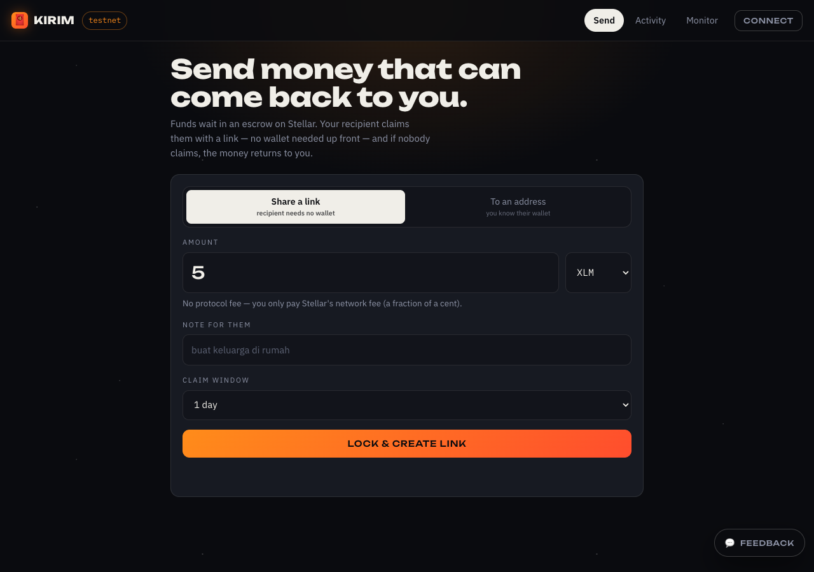
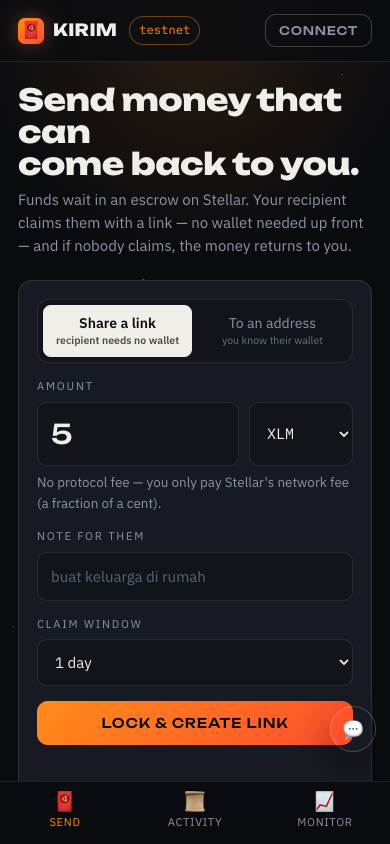
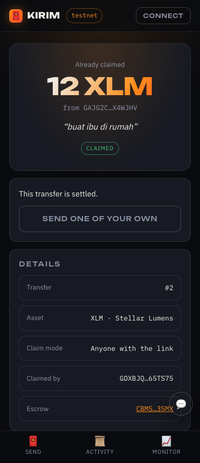
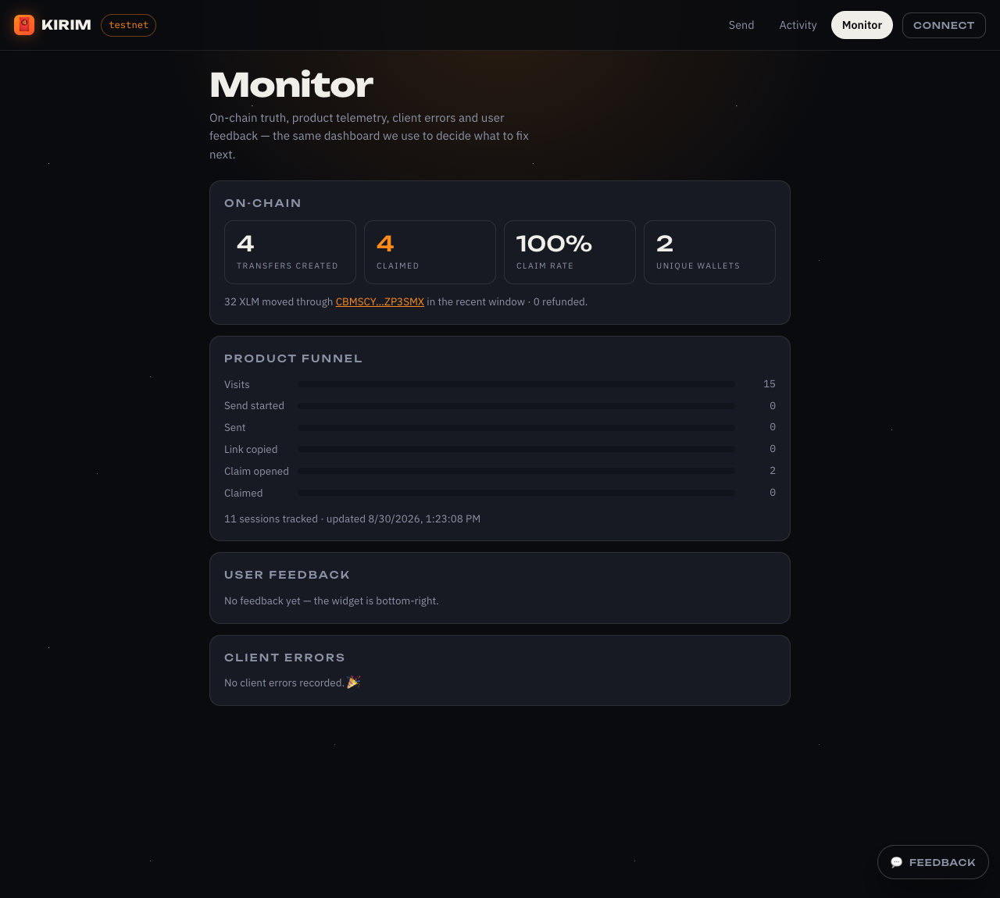
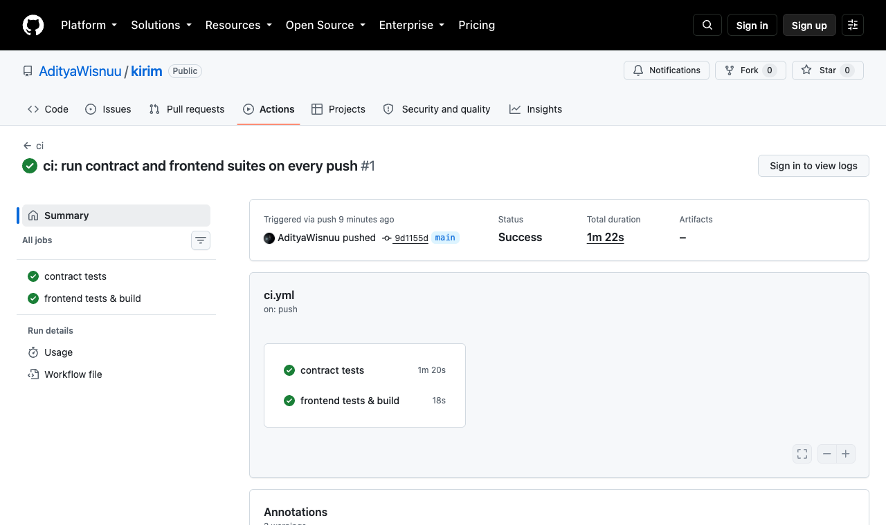
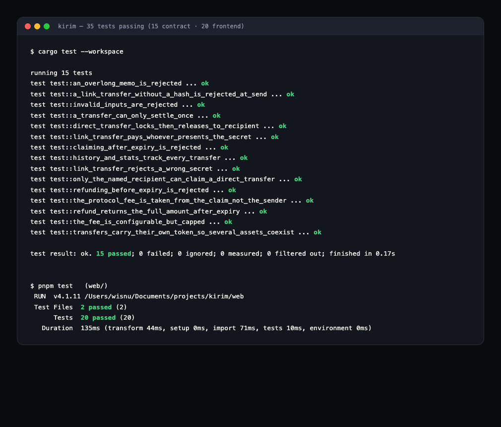

# 🧧 KIRIM — protected money transfers on Stellar

**🌐 Live: https://kirim-app.netlify.app** · **▶️ [Demo video](#demo-video)** · Stellar **testnet**

Green Belt (Level 4) submission for **Stellar Journey to Mastery** (Rise In × Stellar) — the
production MVP of the idea approved at the Idea Submission stage.

> Money on-chain is normally fire-and-forget: one wrong address and it's gone, and the
> recipient must already own a wallet before you can send anything. KIRIM changes both.
> Funds wait in a Soroban **escrow**; the recipient claims them with a **link** (no wallet
> needed up front); and if nobody claims in time, the money **returns to the sender**.

---

## What makes it different

Most Stellar remittance projects are a wallet UI over path payments — their pitch ("cheap,
fast") is Stellar's, not theirs. KIRIM's value is in the mechanism:

| | |
|---|---|
| **Protected, not fire-and-forget** | Funds sit in escrow with an expiry. Unclaimed money auto-returns to the sender — an undo window for on-chain payments. |
| **Recipients need no wallet** | A hashlock claim link means the recipient onboards a wallet *at claim time*. This flips the adoption funnel that kills most remittance apps. |
| **The secret never reaches a server** | The claim secret lives in the URL **fragment** (`#s=…`), which browsers never transmit. The contract only ever stores its SHA-256 hash. |
| **A broader primitive** | The same escrow powers THR/angpao gifting, milestone freelancer payouts and community escrow (rekber). Remittance is the first corridor, not the whole product. |

## How Level 4 requirements are met

| Requirement | Where |
|---|---|
| Production-ready MVP | Full product loop across four routes: send → shareable link → claim → refund, plus activity history and a monitoring dashboard |
| Stable frontend & contract architecture | `contracts/kirim` (Rust) and a modular `web/src` split into `lib/` (chain, wallet, format, secret, analytics), `views/`, `components/` and a History-API router |
| Mobile responsive UI | Mobile-first shell: bottom tab bar on phones, inline tabs from 720px up ([screenshot](#screenshots)) |
| Loading states & error handling | Skeletons on every async surface, five named transaction stages, and 13 contract errors translated into sentences a person can act on |
| Monitoring & analytics | Self-hosted telemetry over Netlify Functions + Blobs — no cookies, no third party — surfaced at [`/monitor`](https://kirim-app.netlify.app/monitor) alongside on-chain metrics and captured client errors |
| User feedback collection | In-app feedback sheet (asked once, after a first successful transfer); the summary is public on `/monitor` |
| Production deployment | Netlify, with SPA routing, API redirects, security headers and immutable asset caching |
| Contract on testnet | [`CBMSCY57EJZHLSGVEGLVKBP75KACEJCJPO7TFEQZOO6T6DYVJDZP3SMX`](https://stellar.expert/explorer/testnet/contract/CBMSCY57EJZHLSGVEGLVKBP75KACEJCJPO7TFEQZOO6T6DYVJDZP3SMX) |
| Tests & CI | **35 tests** — 15 contract (`cargo test`) + 20 frontend (`vitest`) — run on every push by GitHub Actions |
| Documentation | This README, inline module docs, and runnable scripts in `scripts/` |

## Proof on-chain

Both claim modes, exercised end to end on testnet:

- **Direct transfer** — locked for a named recipient, claimed by that wallet only.
- **Link transfer** — `recipient: null`, guarded by `sha256(secret)`; a *different* wallet claimed
  it by presenting the secret: [`62ceb16e…`](https://stellar.expert/explorer/testnet/tx/62ceb16e5db709ae905c640df5636a350378cd27c65884218355c42bb9570244)

Run `./scripts/smoke.sh` to reproduce both against your own deployment.

## Contract API

| Function | Auth | Description |
|---|---|---|
| `send(sender, recipient?, token, amount, memo, ttl_ledgers, claim_hash?) -> u64` | sender | Locks funds. `recipient = None` + `claim_hash` creates a link transfer. |
| `claim(id, claimer, secret?)` | claimer | Releases funds: the named recipient, or anyone presenting the secret. |
| `refund(id)` | sender | Returns the full amount after expiry. |
| `get_transfer(id)` · `sent_by(addr)` · `received_by(addr)` · `stats()` · `fee_bps()` | — | Reads. |
| `set_fee(bps)` | admin | Protocol fee, hard-capped at 2% in the contract itself. |

Thirteen typed errors (`InvalidAmount`, `Expired`, `NotExpiredYet`, `Unauthorized`,
`InvalidSecret`, `SecretRequired`, …) — each mapped to human copy in `web/src/lib/format.js`
and covered by tests.

## Screenshots

| | |
|---|---|
| Product UI |  |
| Mobile — send |  |
| Mobile — claim |  |
| Monitoring & analytics |  |
| CI pipeline |  |
| 35 tests passing |  |

## Demo video

▶️ **[Watch the demo](https://youtu.be/PLACEHOLDER)** — every transfer in the video is sent and
claimed live on testnet during the recording.

## Run it

```bash
# Contract
cargo test                 # 15 tests
stellar contract build
./scripts/deploy.sh        # test → build → deploy → prints the contract id

# Frontend
cd web
pnpm install
pnpm test                  # 20 tests
pnpm dev
```

Point `web/src/lib/config.js` at your own contract id after deploying.

## Architecture

```
contracts/kirim/src/lib.rs   escrow: send · claim · refund, multi-token, capped fee, events
web/src/lib/                 chain (Soroban RPC) · wallet · format · secret · analytics
web/src/views/               send · claim · activity · monitor
web/src/components/          toast · feedback sheet
web/netlify/functions/       track · metrics · feedback  (telemetry over Netlify Blobs)
scripts/                     deploy.sh · smoke.sh
```

**Data flow:** the sender signs `send` → funds lock in the escrow and an event fires → the app
builds a claim link whose secret lives only in the URL fragment → the recipient opens it,
connects (or installs) a wallet → `claim` verifies `sha256(secret)` and releases the funds →
both sides see the state change stream back from contract events. After expiry, `refund`
returns the full amount to the sender.

## Stack

- **Contract:** Rust, `soroban-sdk` — persistent storage with TTL management, ledger time-locks,
  cross-contract calls into Stellar Asset Contracts, typed errors, structured events
- **Frontend:** Vite + vanilla JS (no framework), `@stellar/stellar-sdk`,
  `@creit.tech/stellar-wallets-kit` (Freighter, xBull, Albedo, Lobstr, Hana, Rabet)
- **Platform:** Netlify — static hosting, Functions, Blobs
- **Network:** Stellar testnet

## Author

Aditya Wisnu Wardana — [@AdityaWisnuu](https://github.com/AdityaWisnuu)
· Belt progression: [White](https://github.com/AdityaWisnuu/stellar-white-belt)
· [Yellow](https://github.com/AdityaWisnuu/stellar-yellow-belt)
· [Orange](https://github.com/AdityaWisnuu/stellar-orange-belt)
